# Kubernetes controlled by MCP server observability case study - a summer semester SOA project

Project Acronym: MCP-K8

---

## Contents

1. [Introduction](#1-introduction)
2. [Theoretical background / technology stack](#2-theoretical-background--technology-stack)
3. [Case study concept description](#3-case-study-concept-description)
4. [Case study high level architecture](#4-case-study-high-level-architecture)
5. [Case study detailed architecture](#5-case-study-detailed-architecture)
6. [Environment configuration description](#6-environment-configuration-description)
7. [Installation method](#7-installation-method)
8. [Demo deployment steps](#8-demo-deployment-steps)
9. [Demo description](#9-demo-description)
10. [Summary – conclusions](#10-summary--conclusions)
11. [References](#11-references)

---

## 1. Introduction

The case study aims to integrate [kubernetes-mcp-server](https://github.com/containers/kubernetes-mcp-server) into a sample Kubernetes application with non-trivial architecture and demonstrate how LLM can modify cluster configuration and deployment. Interactions between language model and the K8s runtime should be monitored by Grafana.

For our sample application, we chose [OpenTelemetry Demo Project](https://opentelemetry.io/docs/demo/). The application is designed to serve as a Docker / Kubernetes deployment example. It showcases a modern implementation of an online store, with separate microservices for, among other things, product catalog, cart, payments, reviews, recommendations and provides both web UI and mobile application. It also contains some quality-of-life features for our use-case, like load generator.

---

## 2. Theoretical background / technology stack

The application stack is dictated by the implementation of [OpenTelemetry Demo Project](https://opentelemetry.io/docs/demo/):

### OpenTelemetry
Acts as the foundation of modern observability, providing a unified standard and a set of tools to generate and transmit telemetry data (logs, metrics, and traces). By utilizing the OTLP (OpenTelemetry Protocol) and the Collector component, the project enables seamless integration of services written in various programming languages. In this demo, it serves as the "central nervous system" that aggregates data from microservices and routes it to the appropriate backend systems.
### Prometheus
Collects performance metrics from both the Kubernetes infrastructure layer and directly from application business logic via pull mechanisms or OpenTelemetry Collector integration. It allows for precise tracking of resource utilization (CPU, RAM) and application-specific indicators, which is critical for the LLM's decision-making process during scaling operations.
### OpenSearch
Stores structured text data received from the collector, enabling rapid indexing and searching. Through Grafana integration, it allows users and AI agents to correlate log errors with metric anomalies, significantly accelerating root cause analysis in a distributed microservices environment.
### Jaeger 
Handles distributed tracing in microservice-based systems. It makes it possible to follow requests across multiple services and helps identify latency issues, failed calls, and dependencies between components. In the OpenTelemetry Demo environment, this allows end-to-end request flows to be inspected more easily.
### Grafana
Provides a unified interface for visualizing and exploring observability data such as metrics, logs, and traces. By integrating multiple data sources, it supports both dashboard-based monitoring and ad hoc analysis. This makes it a convenient entry point for observing telemetry collected across the environment.
### Kubernetes 
Enables automated deployment, management, and scaling of containerized applications. It supports service orchestration, workload recovery, and resource control, which makes it well suited to microservice-based environments. In this case, it provides the runtime layer for the demo application and the supporting observability components.
### kubernetes-mcp-server
Serves as a bridge between the language model and the Kubernetes cluster. It gives AI assistants structured access to cluster resources and makes it possible to inspect the environment or perform selected operations through MCP-compatible tools. As a result, cluster interaction can be performed through natural-language prompts rather than through dashboards or manual command-line operations.

**Logs in Grafana:** Application services emit logs via the OpenTelemetry SDK. The OpenTelemetry Collector receives them (OTLP) and exports to OpenSearch. Grafana connects to OpenSearch as a datasource and displays logs in dashboards and Explore.

---

## 3. Case study concept description

The core of this case study is **updating Kubernetes configuration using the Kubernetes MCP server**, integrated with Claude Code or Cursor IDE. Through the chat, you can diagnose issues, observe the application, and scale it up—all driven by natural language prompts.

### Connecting the Kubernetes MCP to Cursor IDE or Claude Code

1. **Add the Kubernetes MCP server** to your IDE’s MCP configuration (e.g. Cursor Settings → Tools & MCP, or `.cursor/mcp.json` / Claude Code MCP config). Use the [kubernetes-mcp-server](https://github.com/containers/kubernetes-mcp-server) configuration from its documentation.
2. **Prerequisites:** Ensure `kubectl` is installed and a cluster is running (e.g. Minikube). The MCP server uses your default kubeconfig (`~/.kube/config`) and current context.
3. **Restart the IDE** so it picks up the new MCP server. The AI assistant can then use the server’s tools to work with the cluster.

### Using the chat to diagnose, observe, and scale up

Once connected, you can use the chat to:

- **Diagnose** – e.g. “List pods in the default namespace”, “Describe the frontend deployment”, “Show recent events for failing pods”. The assistant uses MCP tools to run equivalent `kubectl` commands and interpret the output.
- **Observe** – e.g. “How many replicas are running for each deployment?”. You can cross-check with Grafana dashboards (http://localhost:8080/grafana) for metrics and logs.
- **Scale up** – e.g. “Scale the frontend deployment to 3 replicas” or “Scale up the cart service”. The assistant should use the **Kubernetes MCP** scaling tools (for example `kubectl_scale` on the deployment), not ad hoc `kubectl scale` in a terminal, so scaling stays part of the MCP-driven workflow and matches the case study.

All changes made via the MCP server are reflected in the cluster and can be verified in Grafana.

---

## 4. Case study high level architecture

The demo deploys application microservices (frontend, cart, payment, etc.), the OpenTelemetry Collector, Prometheus, OpenSearch, Jaeger, and Grafana on Kubernetes. Telemetry flows from services to the collector and then to the appropriate backends; Grafana queries these backends for visualization.

---

## 5. Case study detailed architecture

(To be expanded in the full report with diagrams, component descriptions, and data flow.)

---

## 6. Environment configuration description

- **Runtime:** Minikube (Kubernetes)
- **Resources:** 8 GB RAM, 4 CPUs (required for the OpenTelemetry Demo)
- **Namespaces:** `otel-demo` (application services and observability stack)

---

## 7. Installation method

### Prerequisites

- [Minikube](https://minikube.sigs.k8s.io/docs/start/)
- [kubectl](https://kubernetes.io/docs/tasks/tools/)
- [Docker](https://docs.docker.com/get-docker/)

---

## 8. Demo deployment steps

1. Ensure that Docker is running.

   Minikube requires a container or virtual machine driver to start the Kubernetes cluster. In this setup, Docker is used as the Minikube driver, so Docker Desktop should be running before starting Minikube.

2. Start Minikube with sufficient resources:

   ```bash
   minikube start --memory=8192 --cpus=4
   ```

   or with max resources:

   ```bash
   minikube start --memory=max --cpus=max
   ```

3. Deploy the OpenTelemetry Demo:

   ```bash
   kubectl create -n otel-demo -f opentelemetry-demo/kubernetes/opentelemetry-demo.yaml
   ```

4. Enable `kube-state-metrics` service (for grafana k8s monitoring):

   ```bash
   kubectl apply -n otel-demo -f kube-metrics/
   ```
   Later you can import [this dashboard](https://grafana.com/grafana/dashboards/15661-k8s-dashboard-en-20250125/) in grafana (copying ID is the simplest way).

5. Before starting the demo scenario, verify that the application and observability components are running:

   ```bash
   kubectl get pods -n otel-demo
   ```

   On the first run, pulling container images and starting all services can take approximately **5–20 minutes**, depending on the machine and network connection. Most pods should eventually reach the Running status.

   Expected result:

   - All required pods should be in the `Running` status.
   - The output should include application pods such as `frontend-*`, `cart-*`, `checkout-*`, and `product-catalog-*`.
   - Observability-related pods such as `grafana-*`, `prometheus-*`, `opensearch-*`, and `otel-collector-*` should also be present.

   Pod names contain generated suffixes, so exact names will differ between deployments.

6. Start port forwarding

   ```bash
   kubectl port-forward svc/frontend-proxy 8080:8080 -n otel-demo
   ```
7. Configure `kubernetes-mcp-server` for your IDE.
   
   In this project Cursor CLI was used to present the MCP server capabilities. 
   In `~/.cursor/mcp.json` paste:
   ```json
   {
   "mcpServers": {
      "kubernetes-mcp-server": {
         "command": "npx",
         "args": ["-y", "kubernetes-mcp-server@latest"]
      }
   }
   }
   ```

---

## 9. Demo

This section presents the MCP-K8 demo executed after completing the deployment and preparation steps from section 8. At this point, the Minikube cluster should be running, the OpenTelemetry Demo should be deployed in the `otel-demo` namespace, the required pods should be ready, application exposed via port forwarding and MCP server hooked up to the IDE.

### All pods running after deployment
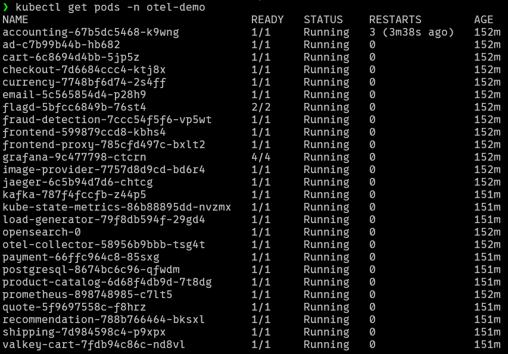

### All services running after deployment
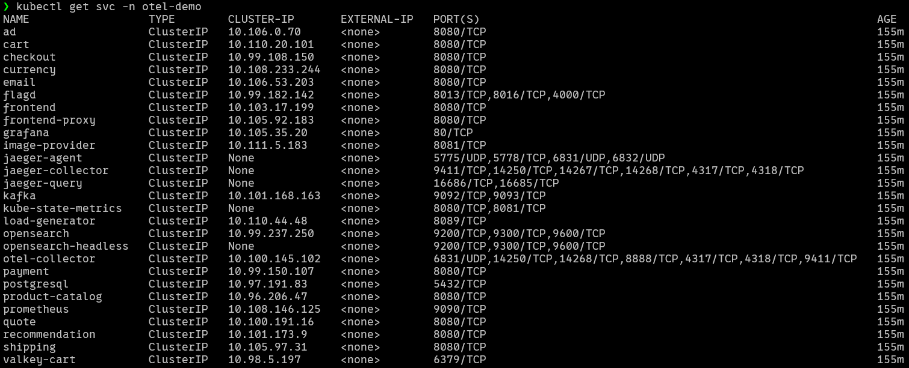


### Accessing web application

Open the web store in a browser:

```text
http://localhost:8080/
```

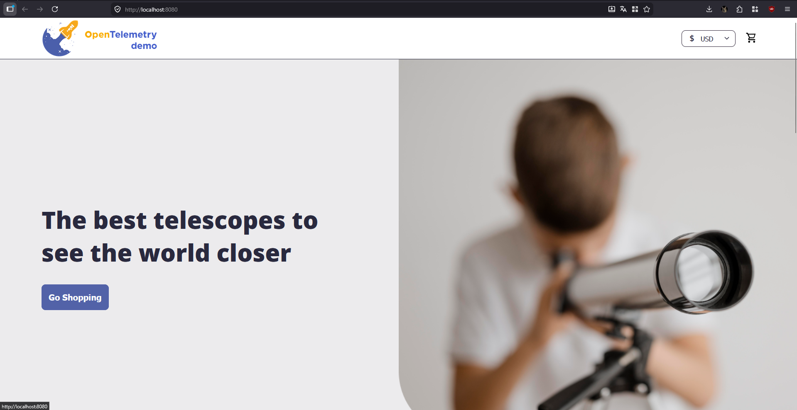

### Accessing Grafana

Open Grafana in a browser:

```text
http://localhost:8080/grafana/
```

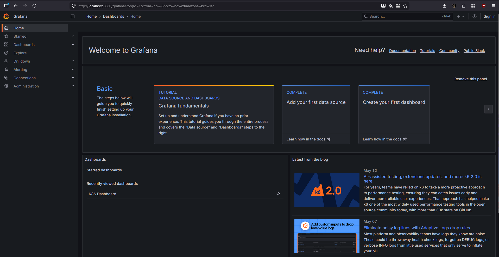

### Importing K8S Dashboard
In Grafana:

Import the Kubernetes dashboard:

1. Open **Dashboards**.
2. Click **New** and then **Import**.
3. Enter the dashboard ID:

   ```text
   15661
   ```

4. Click **Load**.
5. Select the appropriate Prometheus data source.
6. Click **Import**.


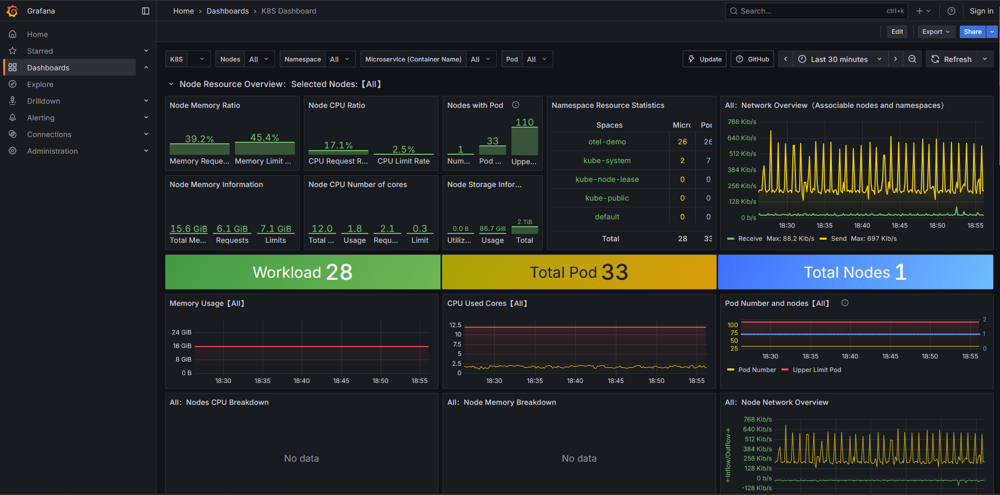

### Listing all Kubernetes pods via MCP

Prompt used:

```text
List all pods in the otel-demo namespace
```
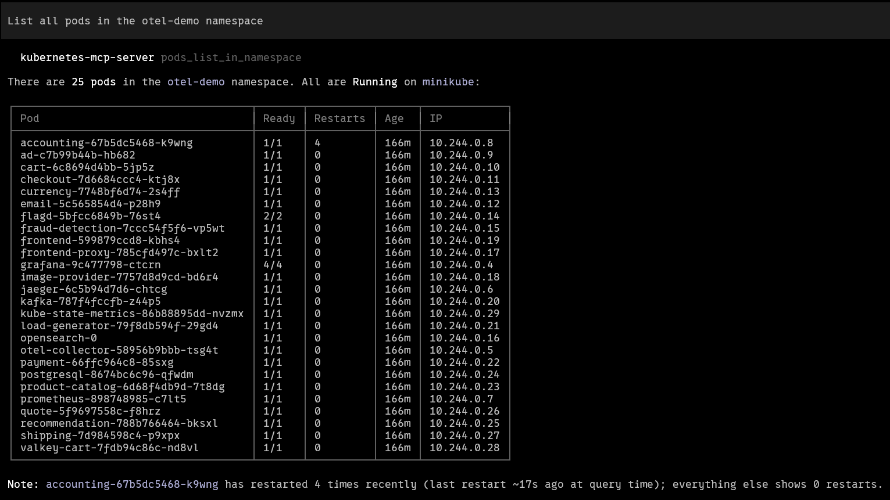

After quick verification we can see that Cursor is making a small mistake - it states that there are 25 pods when actually there are 26. When we count every pod returned by Cursor we can see that it returned 26 pods so it proves that the MCP server works perfectly, and the discrepancy was solely due to a minor counting mistake by the LLM itself.

Clarified it with prompt:
```text
I can count 26 not 25 pods - why did you say 25?
```

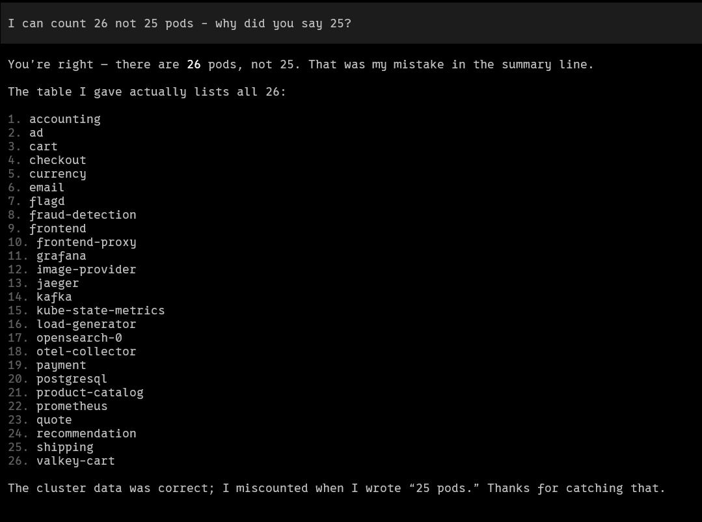

### Listing all Kubernetes services via MCP

Prompt used:

```text
List all services in the otel-demo namespace
```

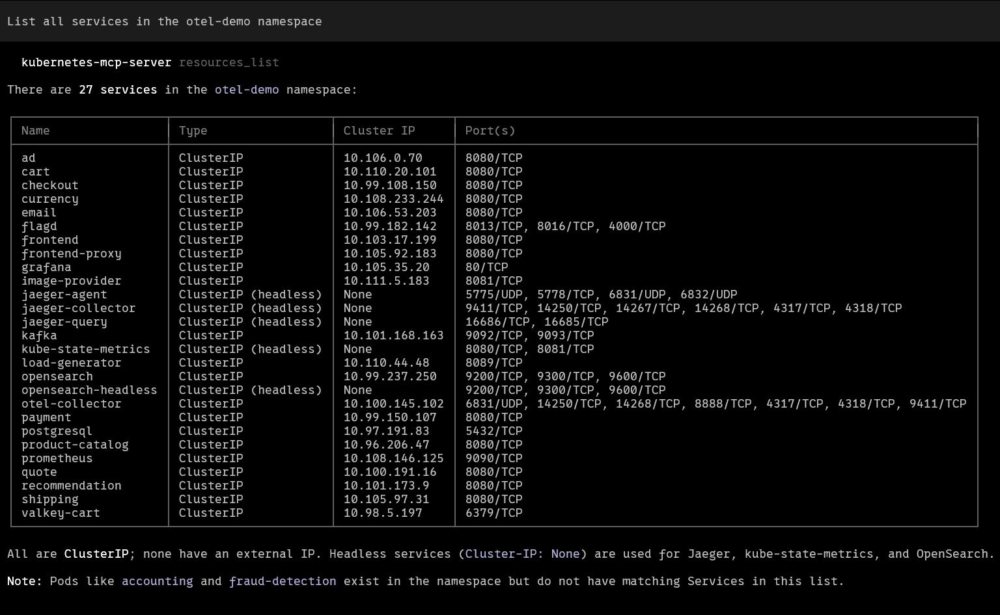

Here Cursor made no mistake.

### Scaling frontend deployment through MCP

The `frontend` deployment is the main Next.js Astronomy Shop UI and is used as the scaling target in this demo.

Let's scale its deployment to 3 replicas.

Before that let's check how many frontend pods are there.
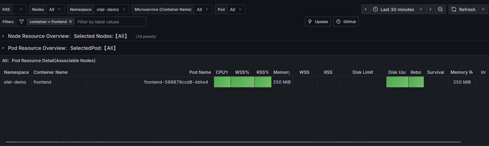
There is only 1.

Now let's ask AI Model to scale `frontend` up to 3 replicas.

Prompt used:

```text
Scale the frontend deployment in the otel-demo namespace to 3 replicas
```

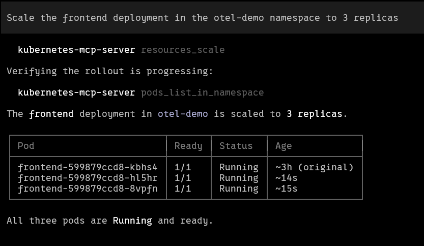

As we can see Cursor not only used the `resources_scale` tool but also checked the state of the frontend pods with `pods_list_in_namespace` tool.

Coming back to Grafana dashboard we can observe new pods listed there:
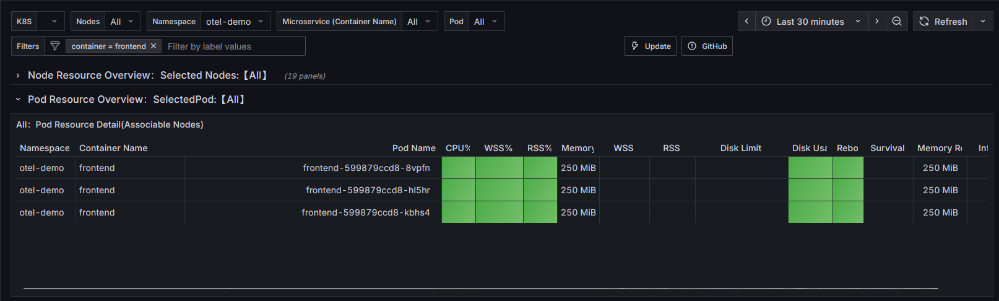

---

## 10. References

- [OpenTelemetry Demo Project](https://opentelemetry.io/docs/demo/)
- [Jaeger](https://www.jaegertracing.io/docs/latest/)
- [Grafana](https://grafana.com/docs/grafana/latest/)
- [Kubernetes](https://kubernetes.io/docs/home/)
- [kubernetes-mcp-server](https://github.com/containers/kubernetes-mcp-server)
- [Grafana](https://grafana.com/)
- [Prometheus](https://prometheus.io/)
